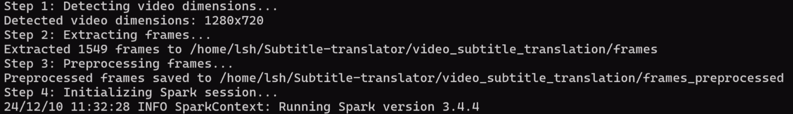

# 视频翻译项目

## 研究目的

随着多媒体内容的快速增长，视频处理与分析已成为各行业中至关重要的技术需求。特别是在全球化和跨语言交流日益频繁的背景下，视频字幕的翻译成为了一项亟待解决的技术挑战。本项目旨在开发一个基于**分布式计算**和**深度学习**的视频翻译系统，使用 **OCR 技术**提取视频帧中的英文字幕，并通过 **Ollama 翻译模型**将其翻译为中文，最终合成带有中文字幕的视频。通过结合 **Apache Spark** 的分布式处理能力、 OCR 识别技术以及大语言模型的自然语言处理能力，本项目旨在提高大规模视频翻译的效率和准确性，减少人工翻译成本，为视频观看中复杂的字幕翻译任务提供技术支持。

## 研究方法

### 项目关键技术

#### 1. 视频预处理与帧提取
使用 **OpenCV** 从输入视频中提取每一帧，并进行预处理（如灰度化、尺寸调整等），为OCR识别做好准备。

#### 2. OCR文本提取
使用 **PaddleOCR** 对视频帧中的文本进行识别，提取出每一帧的字幕。

#### 3. 句子分组
根据 OCR 识别结果，对相似的句子进行分组，减少翻译的重复性，从而提高翻译效率。

#### 4. 自动翻译
调用 **Ollama API** 进行字幕翻译，将识别出的英文字幕翻译成中文。通过集成 Ollama 提供的模型进行高效的翻译。

#### 5. 字幕合成与视频生成
将翻译后的字幕与原视频帧合成，最后通过 **FFmpeg** 工具合成完整的带字幕的视频文件。

#### 6. 分布式处理
为了处理大规模视频数据，本项目使用 **Apache Spark** 进行分布式计算，确保高效处理海量视频数据并支持多语言字幕翻译。

### 项目结构

#### 文件目录

```plaintext
.
├── frames/                          # 提取出来的视频帧
├── frames_preprocessed/             # 预处理结束的视频帧
├── output_video/                    # 输出视频存放目录
├── input_video                      # 输入视频存放目录
│   └── video-all.mp4                # 待处理的视频文件
├── grouped_sentences.json           # 视频帧分组翻译结果
├── combine_video.py                 # 合并翻译后的字幕与视频帧
├── extract_frames.py                # 提取视频帧的脚本
├── ocr.py                           # 字幕 OCR 识别脚本
├── translate.py                     # 字幕翻译脚本
├── preprocess_frames.py             # 视频帧预处理脚本
└── spark_job.py                     # 提交 Spark 作业的主程序
```
#### 文件说明

##### `spark_job.py` 
- 视频预处理：
从输入视频中提取帧并对其进行预处理，确保 OCR 识别的效果最佳。
- OCR 识别：
对所有帧进行 OCR 处理，提取每一帧中的文本（字幕）。
- 句子分组：
根据 OCR 识别的文本内容的相似性，将相似的句子归为一组。这样可以减少重复的翻译操作，节省时间。
- 翻译：
使用翻译模型（假设已配置好翻译接口）对每组相似句子进行翻译。
- 合成字幕：
将翻译后的字幕合成回原视频帧，生成带有字幕的视频帧。
- 合成最终视频：
带字幕的帧重新合成回一个完整的视频文件。

##### `extract_frames.py`
- 读取视频文件：
利用 OpenCV 的 `cv2.VideoCapture` 函数加载视频文件。
- 提取视频帧：
通过逐帧读取视频，并将每一帧保存为图像文件（通常是JPEG格式）。
- 保存到指定目录：
将每一帧图像以命名方式保存到指定的输出目录中，命名规则为 frame_XXXX.jpg，其中 XXXX 是帧的编号。

##### `preprocess_frame.py`
- 创建输出目录
- 循环遍历输入目录中的每一帧，并转换为灰度图像、调整尺寸
- 保存处理后的帧

##### `ocr.py`
- 对图像进行ocr识别，检测并提取图像中的文本。

##### `translate.py`
- 调用 Ollama API
- 处理翻译结果并返回

##### `combine_video.py`
- 初始化：
加载帧图像目录和字幕数据（grouped_sentences）。
- 遍历字幕数据：
为每个帧获取对应的字幕。
- 处理每一帧：
遍历帧图像文件，提取帧编号。
查找该帧是否有字幕，如果有，则调用 `overlay_subtitles` 将字幕添加到图像上。
- 保存带字幕的帧：
将处理后的帧保存到指定的输出目录,并把所有带字幕的帧被保存到输出目录，处理完成。

### 依赖安装

#### 1. 虚拟机配置
建议配置：
- **磁盘空间**：50GB
- **内存**：13.3GB（可根据负载调整）

#### 2. Python 环境依赖
请使用 Python 3.7 至 3.9 版本。可通过以下命令安装所需依赖：

```bash
pip install -r requirements.txt
```

#### 3. 中文字体设置
如果系统没有所需的中文字体，请下载并安装 Source Han Serif SC 字体，并在 `combine_video.py` 文件中进行替换：

```python
font = ImageFont.truetype("/usr/share/fonts/truetype/SourceHanSerifSC-VF.ttf", 20)
```
#### 4. PaddleOCR 安装
在安装 PaddleOCR 时，建议使用清华源：

```bash
python -m pip install paddlepaddle -i https://pypi.tuna.tsinghua.edu.cn/simple
```
#### 5. Ollama 安装与配置
在Linux系统中安装 Ollama：

```bash
curl -fsSL https://ollama.com/install.sh | sh
```
启动 Ollama 服务：

```bash
ollama serve
```
选择翻译模型 qwen2.5:1.5b-instruct-q8_0 进行翻译。

### 运行步骤（单机模式）

#### 1. 启动 Spark
启动Spark集群：
```
start-master.sh
start-worker.sh
spark://<master-ip>:7077  # master-ip 设置为 localhost
```
#### 2. 修改路径配置
在 `spark_job.py` 文件的第40行，将翻译结果存储路径修改为本地路径，避免路径错误：
```
translated_rdd.saveAsTextFile("file:///home/xuqi/video_subtitle_translation/translated_subtitles")
```
#### 3. 提交 Spark 作业
在每次运行之前，请确保删除 `translated_subtitles/` 目录中的输出文件。只需删除整个目录即可。运行以下命令启动Spark作业：
```
spark-submit --master local[4] spark_job.py
```
如果希望测试不同的并行数和分区，可以修改命令，提升运行效率。例如，对于 12 秒的 video-all.mp4，单机模式下大约 3 分钟内完成：
```
spark-submit --master local[4] --conf spark.default.parallelism=8 --conf spark.sql.shuffle.partitions=8 spark_job.py
```
#### 注意事项
- 在 `spark_job.py` 文件中，确保在每次提交前删除 `translated_subtitles/` 目录，否则会出现重复输出的情况。
- 每个步骤（例如视频帧提取、字幕识别、翻译等）都会生成一个新的子目录，这些目录会自动创建，确保路径的有效性和清晰。
```
这个 Markdow 格式的 README 包含了项目的详细说明、依赖项安装、配置步骤以及如何运行 Spark 作业的指导，适合直接使用。
```

### 运行步骤（分布式部署）

#### 1. 启动 Spark 集群
启动Spark集群（这里介绍分布式模式）：
```
./sbin/start-master.sh  # 启动 Spark Master 节点
./sbin/start-worker.sh spark://<master-ip>:7077  # 启动 Spark Worker 节点，master-ip 设置为 Spark Master 节点的 IP 地址
可以通过 http://<master-ip>:8080 来查看集群的状态。
```

#### 2. 修改路径配置
在 `spark_job.py` 文件的第40行，将翻译结果存储路径修改为集群可访问的路径（如HDFS路径或者网络共享路径），以避免路径错误：
```
translated_rdd.saveAsTextFile("hdfs://namenode:9000/video_subtitle_translation/translated_subtitles")
```
#### 3. 提交 Spark 作业
在每次运行之前，请确保删除 translated_subtitles 目录中的输出文件。只需删除整个目录即可。运行以下命令启动Spark作业：
```
spark-submit --master spark://<master-ip>:7077 \
             --deploy-mode cluster \
             --conf spark.executor.memory=4G \
             --conf spark.executor.cores=2 \
             --conf spark.driver.memory=4G \
             --conf spark.driver.cores=2 \
             spark_job.py
```
如果希望测试不同的并行数和分区，可以修改命令，提升运行效率。例如，对于 12 秒的 video-all.mp4，在集群模式下大约 3 分钟内完成：
```
spark-submit --master spark://<master-ip>:7077 \
             --deploy-mode cluster \
             --conf spark.default.parallelism=16 \
             --conf spark.sql.shuffle.partitions=16 \
             spark_job.py
```

#### 注意事项
- 在 `spark_job.py` 文件中，确保在每次提交前删除 `translated_subtitles/` 目录，否则会出现重复输出的情况。
- 每个步骤（例如视频帧提取、字幕识别、翻译等）都会生成一个新的子目录，这些目录会自动创建，确保路径的有效性和清晰。
- 使用HDFS或其他共享存储路径，确保在集群的所有节点上路径一致。

#### 优化过程

在初步实现代码并完成单机部署后，尽管系统能够基本完成视频字幕的提取与翻译，但仍面临一些明显的挑战，主要表现为**翻译错误率高**和**处理时间过长**。为了解决这些问题，我们进行了以下几方面的优化：

##### 1. 翻译错误率高
通过深入分析，我们发现翻译错误的主要原因是**OCR识别准确度低**，尤其是在复杂的背景下，OCR模型未能有效识别视频中的字幕，导致错误识别的情况频发。为了解决这一问题，我们决定替换原有的OCR模型，选择了业界较为先进的 **PaddleOCR**，该模型在图像文本识别上具有更高的准确率和更强的适应性，尤其是在多语言及复杂背景下的识别效果得到了显著提升。

此外，翻译准确度不高的另一个问题是翻译模型的选择。原先使用的翻译模型无法很好地处理专业术语和一些细节，因此我们决定将翻译部分的语言模型更换为 **Ollama**，这一模型在处理大规模文本翻译时表现出了较高的翻译质量，特别是在处理长文本和语境翻译时，相较于传统的翻译系统，它能够保持更高的语义一致性。更换 OCR 和翻译模型后，翻译的准确率有了显著提升。

##### 2. 处理时间过长问题
原始代码在视频处理时，针对每一帧都进行了逐帧的 OCR 识别和翻译操作。这种处理方式虽然能保证翻译的完整性，但由于很多视频帧内容相似（尤其是存在大量重复字幕的场景），导致了大量重复的处理计算。为了降低计算冗余，我们对原有逻辑进行了优化：

- **帧选择与去重**：我们引入了帧选择机制，对于字幕内容重复的帧，我们避免了重复的 OCR 识别和翻译处理。具体来说，系统会首先识别每一帧的字幕内容，并对其进行去重。对于重复字幕的帧，我们直接使用已翻译的内容进行替换，而无需重新翻译。这一优化大大减少了处理过程中不必要的计算，显著提升了处理效率。
  
- **处理时间缩短**：通过上述优化，原先视频处理时的平均时长（以项目文件中的 `video-all.mp4` 为例）由**30分钟**缩短至约**7分钟**。这一变化显著提升了系统的响应速度和用户体验。

进一步的，我们决定进行**分布式部署**以进一步加速处理过程。通过部署Spark集群，并在集群中调整**分区数**和**并行度**，我们能够充分利用多节点的计算资源，进一步减少视频翻译任务的处理时间。经过多次实验和调优，我们最终将处理时间从**7分钟**进一步缩短至**5分钟**，显著提高了视频处理的吞吐量和效率。

#### 研究结果

通过一系列优化和技术调整，最终我们成功地将视频字幕翻译任务部署在了**Spark分布式环境**下，并取得了显著的成果：

- **翻译准确率**：通过更换 **PaddleOCR** 作为文本提取模型和 **Ollama** 作为翻译模型，我们显著提高了翻译准确率。OCR 的改进使得字幕提取更加精确，而 Ollama 翻译模型则在多种语言和复杂句式的翻译中表现得尤为出色。最终的翻译结果在多轮验证中表现出了较高的准确性和语境一致性。


- **处理时间优化**：通过对代码逻辑的优化和分布式部署的引入，视频处理的时长得到了大幅度的缩短。单机处理时长由原本的**30分钟**减少至**7分钟**，而经过分布式处理后，最终处理时间进一步降至**5分钟**左右。这不仅显著提升了系统的响应速度，也为大规模视频处理任务提供了可行的技术方案。



- **人力与物力节省**：优化后的系统大大减少了人工翻译的需求，降低了人工翻译过程中的错误率和工作强度。同时，分布式计算使得整个处理过程能够高效完成，减少了对硬件资源的依赖，使得视频翻译项目能够在更短的时间内完成更多视频数据的处理，具有显著的节能和成本效益。

综上所述，经过一系列技术优化和分布式处理的引入，我们成功解决了翻译准确率低和处理时间长的问题。最终，基于 **Apache Spark** 和**深度学习技术**的结合，我们实现了高效、准确的视频字幕翻译系统，不仅提升了翻译的质量，也极大地缩短了处理时间，节省了大量的人工和计算资源。

#### 小组分工
陈沁文（贡献40%）
负责视频处理模块中 OCR 模型和语言模型调用的实现、代码优化，以及单机部署实现和参与分布式部署。

许琪（贡献20%）
负责 OCR 文本提取模块实现、代码优化，以及单机部署实现和参与分布式部署。

李思涵（贡献20%）
部分代码编写、代码优化以及参与分布式部署，制作ppt并展示。

汪思远（贡献20%）
部分代码编写、代码优化以及参与分布式部署，编写README。
